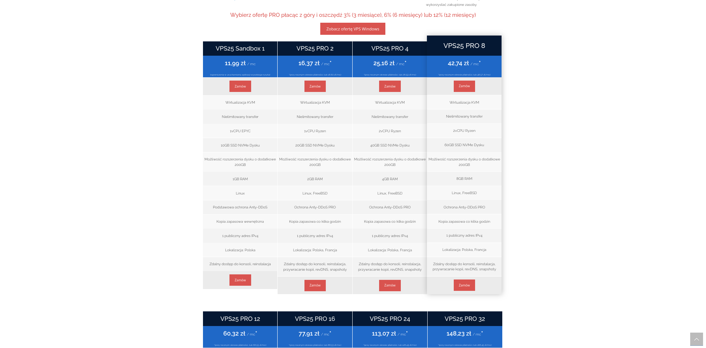
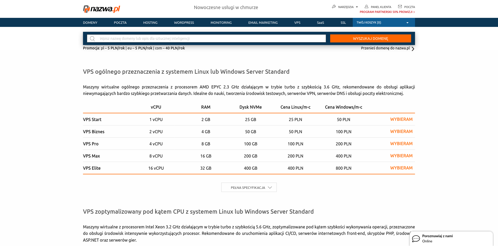
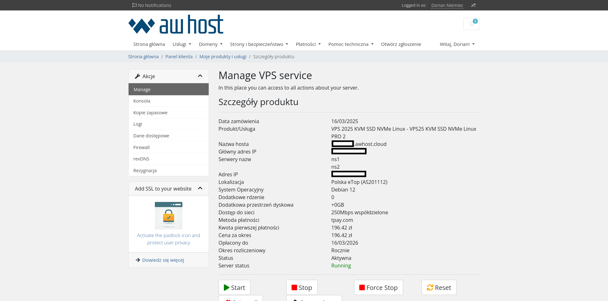
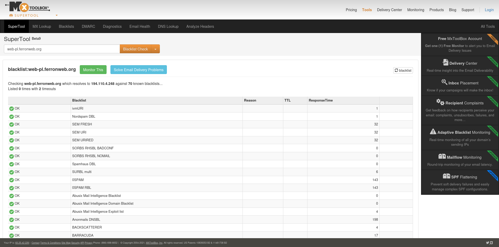
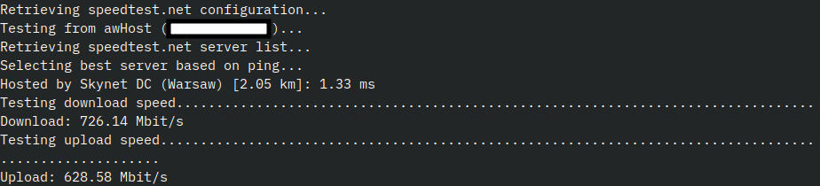

[awHost](https://awhost.pl/) is a Polish VPS hosting provider that is known for offering cheap, affordable VPS servers.

This VPS hosting provider provides the VPS server that powers the website you are reading this post on (as of time of writing the post).

In this post, we will review awHost as the VPS hosting provider, explore their pricing, performance, and features.

## Pricing and plans

awHost offers VPS servers with GNU/Linux, Windows, and FreeBSD. All of their VPS servers have unlimited bandwidth, and the ability to extend disk space up to additional 200 GB.

awHost allows you to choose one of these systems by default:

- Windows Server 2019 Standard PL
- Windows Server 2022 Standard PL
- Debian 12
- Debian 11
- Debian 10
- Ubuntu 22.04 LTS (root)
- Ubuntu 22.04 LTS
- Ubuntu 20.04 LTS (root)
- Ubuntu 20.04 LTS
- AlmaLinux 8.5
- FreeBSD 13 x64
- FreeBSD 12 x64
- VestaCP (Debian 12)
- TeamSpeak 3 (Debian 12)
- TeamSpeak 3 + Sinusbot (Debian 12)
- Debian 11 + Virtualmin
- Debian 11 + Cockpit
- Ubuntu 22.04 LTS + Cockpit
- Ubuntu 22.04 LTS (root) + Cockpit
- Debian 11 + ISPConfig
- MikroTik Cloud Hosted Router

Windows Server VPS servers from awHost are generally more expensive than GNU/Linux or FreeBSD VPS servers. For example the "VPS25 KVM SSD NVMe Linux PRO 4" plan (2 vCores, 4GB RAM, 40GB SSD NVMe) from awHost costs around $81.42 (301.91 zł) per year when billed annually, while the almost equivalent "VPS25 KVM SSD NVMe Windows PRO 4" plan (2 vCores, 4GB RAM, 40GB SSD NVMe) from awHost costs around $190.21 (705.32 zł) per year when billed annually.

awHost also allows adding additional cores or upgrading the bandwidth when ordering a VPS server.

awHost supports two locations - Poland (through eTop), and France (through OVH).

awHost also offers anti-DDoS protection along with their VPS servers. For the Polish location, this is done by selective blackholing, while for the French location, a more advanced anti-DDoS protection is used.

awHost offers relatively cheap VPS servers, compared to other Polish VPS providers like nazwa.pl:

- A 1 vCore, 2GB RAM VPS plan with GNU/Linux costs around $5.02 (18.60 zł) per month when billed monthly on awHost, while the almost equivalent general-purpose VPS plan costs around $6.74 (25 zł) per month on nazwa.pl.
- A 2 vCore, 4GB RAM VPS plan with GNU/Linux costs around $7.71 (28.59 zł) per month when billed monthly on awHost, while the almost equivalent general-purpose VPS plan costs around $13.49 (50 zł) per month on nazwa.pl.
- A 2 vCore, 4GB RAM VPS plan with Windows Server costs around $18.01 (66.79 zł) per month when billed monthly on awHost, while the almost equivalent general-purpose VPS plan costs around $26.97 (100 zł) per month on nazwa.pl.

There is also a "VPS25 KVM SSD NVMe Linux Sandbox 1" plan, but this plan doesn't allow some uses of the VPS server, like running resource-intensive services, running services with high risk of attacks (like public game servers, Tor or proxy servers) or running services that can cause adding the IP address to blocklists (like mailing or network attacks).

The customers can pay for the VPS servers either through Tpay, PayPal, or paysafecard. It's possible for international customers to pay for the VPS servers through PayPal.

Overall, awHost has very competitive pricing compared to some other VPS providers in Poland.

## VPS server management

After purchasing a VPS server, the server gets provisioned for some time. After provisioning the server, the data for logging into a VPS server via SSH can be accessed either through an email message, or through the hosting panel.

The reverse DNS hostname can be also configured through the hosting panel. This can be useful for systems that verify a server based on reverse DNS (for example many email servers).

awHost also offers periodic backups along with their VPS servers, and option to restore from these backups. This can be useful if something goes wrong in the VPS.

It's also possible to start, stop, force stop and reset a VPS. There are also options for reinstalling and rescue boot, in case something seriously goes wrong.

The VPS can also be accessed through a web console, allowing administrators to access a VPS in case the network connection gets misconfigured or some other problems.

## Inside the VPS

The SSH service is configured to be on a non-standard port, reducing some risk of SSH attacks (many scanners and bad bots connect to a standard SSH port 22).

The port 25 is unblocked by default in VPS servers (at least for Polish location). This can be useful when setting up a VPS as a mail server.

Checking one of the VPS servers from awHost (one that runs the website you're reading the website on as of the time of writing the post), the server doesn't appear to be listed in a blocklist, further enhancing the trust of the VPS provider.

The VPS servers from awHost appear to have IPv4 addresses only. If you would like to use IPv6, you'll have to use an IPv6 tunneling service, like [one from Hurricane Electric](https://tunnelbroker.net/).

Checking the internet speed using `speedtest-cli` tool, you can see that the internet speed is higher than the specified 250 Mbps speed. This might be possibly due to the internet connection being shared and the specified speed being the average internet speed.

The VPS servers have root access (at least for Debian 12 systems), allowing greater flexibility in administering the server.

## Customer support

awHost offers customer support through support tickets in the hosting panel. awHost also has a knowledge base guiding administrators through common server configurations.

## Conclusion

In conclusion, awHost stands out as a compelling choice for those looking for affordable VPS hosting in Poland. With a diverse range of operating systems, competitive pricing, and important features like unlimited bandwidth and anti-DDoS protection, awHost caters to both individual users and businesses alike. Their user-friendly management panel and robust customer support further enhance the overall experience, making it easier for users to manage their servers effectively.

While the pricing for Windows Server plans is noticably higher, the value offered by their Linux and FreeBSD options is hard to beat, especially when compared to other local providers. The ability to customize plans with additional resources and the inclusion of periodic backups add to the appeal, ensuring that users can tailor their hosting solutions to meet specific needs.

Overall, if you're in the market for a reliable and cost-effective VPS provider in Poland, awHost is certainly worth considering. With its strong performance, flexibility, and commitment to customer satisfaction, it positions itself as one of the best options available for budget-conscious users looking for quality VPS hosting.
