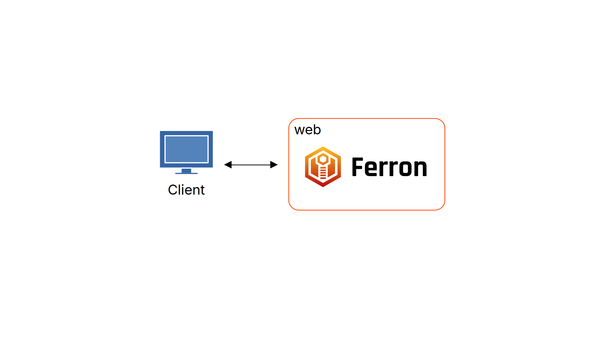
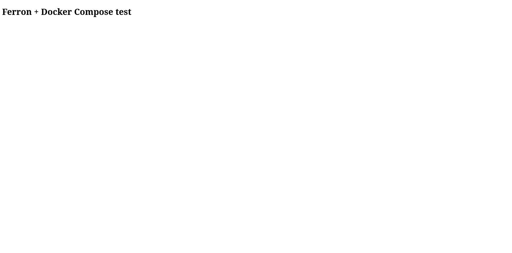
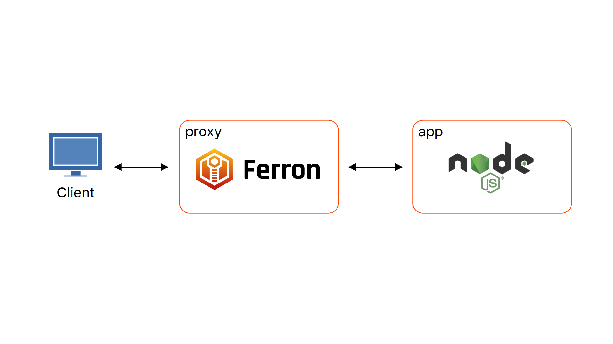
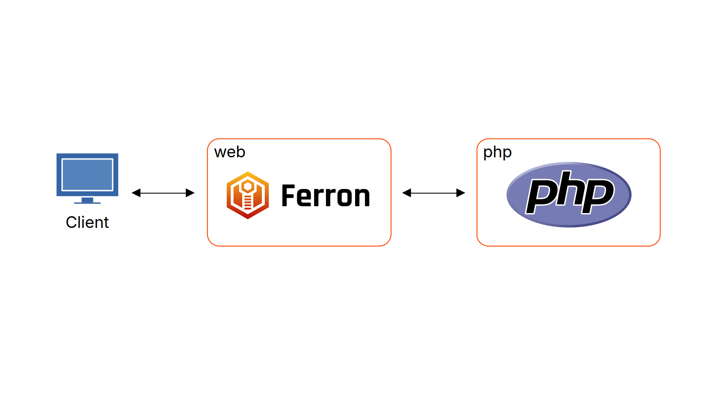
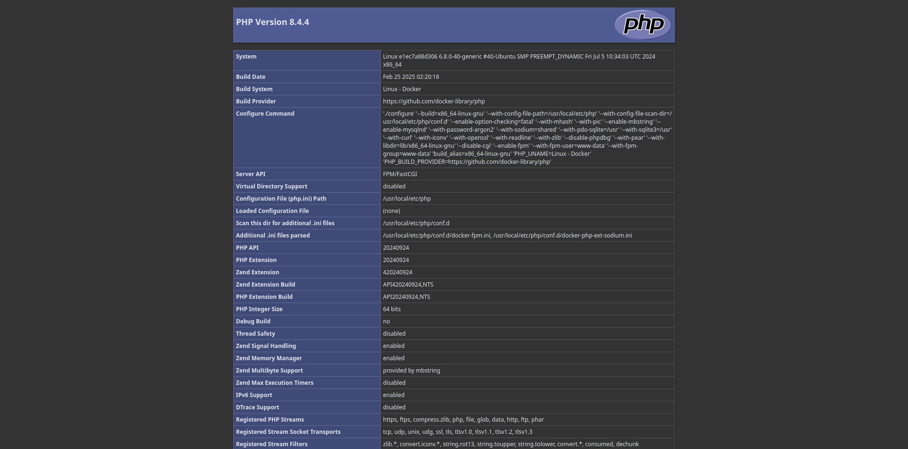

Ferron is designed to be a fast, memory-safe web server. It supports both static file serving and dynamic content (including PHP). It can be also used as a reverse proxy.

Docker Compose is a tool used to define and run multi-container applications as multiple Docker containers.

Combining Ferron with Docker Compose has several benefits, such as isolated environment, simplified deployment, and scalability.

In this post, you will configure Ferron with Docker Compose in various configurations.

## Simple static web server



For this use case, we are going to use Ferron's Docker image, along with a volume containing static files.

First, create a directory which will contain the Docker Compose configuration and the webroot. Then create a `docker-compose.yml` file with these contents:

```yaml
version: "3.8"

services:
  web:
    image: ferronserver/ferron:1
    container_name: ferron_static_website
    ports:
      - "80:80"
    volumes:
      - ./html:/var/www/ferron
    restart: always
```

In this Docker Compose configuration, there is one "web" service running in the "ferron_static_website" container that uses `ferronserver/ferron` Docker image. The service maps port 80 on the host machine to port 80 inside the container. The `./html` directory is also mounted to `/var/www/ferron` (Ferron's webroot) in the Docker container, allowing for easy updates to the static website without rebuilding the entire container. The service automatically restarts if it stops or the system reboots.

After creating the Docker Compose configuration, create a `html` directory, and create a `index.html` file in the `html` directory with these contents:

```html
<!DOCTYPE html>
<html lang="en">
  <head>
    <meta charset="UTF-8" />
    <meta name="viewport" content="width=device-width, initial-scale=1.0" />
    <title>Ferron + Docker Compose test</title>
  </head>
  <body>
    <h1>Ferron + Docker Compose test</h1>
  </body>
</html>
```

After creating the `index.html` file, change the current directory to one containing `docker-compose.yml` file, and run this command:

```sh
docker-compose up -d
```

After running this command, the static file server will be available at `http://localhost/`. When browsing this website, this page should appear:



You have now set up a simple static web server with Ferron and Docker Compose.

## Reverse proxy for Node.js "Hello World" application



For this use case, we are also going to use Ferron's Docker image, along with custom configuration, and a custom Docker image containing the web application based on Node.js's Docker image.

First, create a directory which will contain the Docker Compose configuration and the web application code. Then create a `docker-compose.yml` file with these contents:

```yaml
version: "3.8"

services:
  app:
    container_name: nodejs_web_application
    build:
      context: ./app
    restart: always
    networks:
      - my-network

  proxy:
    image: ferronserver/ferron:1
    container_name: ferron_reverse_proxy
    ports:
      - "80:80" # Expose Ferron on port 80
    volumes:
      - ./ferron.yaml:/etc/ferron.yaml
    restart: always
    networks:
      - my-network

networks:
  my-network:
    driver: bridge
```

In this Docker Compose configuration, there are two services - "app" for the web application, and "proxy" for the reverse proxy. The "app" service is a Node.js web application built from the `./app `directory, exposed on port 3000, and connected to a custom network named "my-network". The "proxy" service uses the `ferronserver/ferron` image to set up a reverse proxy, mapping port 80 on the host to port 80 on the container. It mounts a local `ferron.yaml` configuration file into the container and is configured to always restart in case of failure. Both services are part of the same "my-network", which uses the bridge driver to enable communication between them. This setup allows the reverse proxy to manage traffic to the Node.js application.

After creating the Docker Compose configuration, create a `ferron.yaml` file with these contents:

```yaml
global:
  loadModules:
    - rproxy
  proxyTo: http://app:3000
  logFilePath: /var/log/ferron/access.log
  errorLogFilePath: /var/log/ferron/error.log
```

This Ferron configuration loads a "rproxy" module, which enables reverse proxy functionality. The configuration also specifies that the requests are proxied to `http://app:3000` backend. This is because Docker Compose sets up a network where service names are resolved to the appropriate container IP addresses. Finally, the configuration specifies log paths for Ferron to log requests into.

After creating the Ferron configuration, create a `app` directory. In the `app` directory, add this `package.json` file:

```json
{
  "name": "hello-world-app",
  "version": "1.0.0",
  "private": true,
  "main": "index.js",
  "scripts": {
    "start": "node index.js"
  },
  "dependencies": {
    "express": "^4.21.2"
  }
}
```

Inside the `app` directory, create a `index.js` file containing the web application code:

```js
const express = require("express");
const app = express();
const PORT = process.env.PORT || 3000;

app.get("/", (req, res) => {
  res.send("Hello World!");
});

app.listen(PORT, () => {
  console.log(`Server is running on port ${PORT}`);
});
```

In the same directory, create a Dockerfile used to build the web application image:

```dockerfile
# Use the official Node.js image
FROM node

# Set the working directory
WORKDIR /usr/src/app

# Copy package.json and install dependencies
COPY package*.json ./
RUN npm install

# Copy the rest of the application code
COPY . .

# Expose the application port
EXPOSE 3000

# Command to run the application
CMD ["node", "index.js"]
```

This Dockerfile is a set of instructions for building a Docker image to run a Node.js application. It starts by using the official Node.js image as the base. The working directory is set to `/usr/src/app`, where the application will reside. It then copies the `package.json` file (and optionally `package-lock.json`) to the working directory and installs the necessary dependencies using `npm install`. After that, the rest of the application code is copied into the container. The application is configured to listen on port 3000, which is exposed to the host machine. Finally, the `CMD` instruction specifies that the application should be started by running `node index.js` when the container is launched.

After that, change the current directory to one containing `docker-compose.yml` file, and run this command:

```sh
docker-compose up -d --build
```

After running this command, the web application reverse proxied through Ferron will be available at `http://localhost/`.

You have now set up a web application reverse proxied with Ferron using Docker Compose.

## PHP web server



For this use case, we are also going to use Ferron's Docker image, along with custom configuration, and a PHP-FPM Docker image.

First, create a directory which will contain the Docker Compose configuration and the webroot. Then create a `docker-compose.yml` file with these contents:

```yaml
version: "3.8"

services:
  web:
    image: ferronserver/ferron:1
    container_name: ferron_php_server
    ports:
      - "80:80" # Expose Ferron on port 80
    volumes:
      - ./app:/var/www/ferron
      - ./ferron.yaml:/etc/ferron.yaml
    depends_on:
      - php
    networks:
      - app-network

  php:
    image: php:fpm
    container_name: php_fpm
    volumes:
      - ./app:/var/www/ferron # Shared volume with web server (the directory need to be the same path as in Ferron, otherwise PHP-FPM will respond with "File not found.")
    networks:
      - app-network

networks:
  app-network:
    driver: bridge
```

This Docker Compose configuration defines a setup for running the Ferron web server with PHP-FPM using Docker. It consists of two services: "web" and "php". The "web" service runs a container from the `ferronserver/ferron` image, exposing port "80", and mounts local directories for application files (`./app:/var/www/ferron`) and configuration (`./ferron.yaml:/etc/ferron.yaml`). It depends on the "php" service, which runs a container from the `php:fpm` image, exposing port "9000", and shares the same application volume to ensure proper file access. Both services are connected via a custom bridge network (`app-network`), allowing seamless communication between them.

After creating the Docker Compose configuration, create a `ferron.yaml` file with these contents:

```yaml
global:
  wwwroot: /var/www/ferron
  loadModules:
    - fcgi
  fcgiScriptExtensions:
    - .php
  fcgiTo: tcp://php:9000
  logFilePath: /var/log/ferron/access.log
  errorLogFilePath: /var/log/ferron/error.log
```

This Ferron configuration loads a "fcgi" module, which enables FastCGI client functionality. The configuration specifies `/var/www/ferron` as the webroot and that filenames ending with ".php" are handled via FastCGI client. The configuration also specifies that the requests are sent to the `php` host with port 9000 (default PHP-FPM port). Finally, the configuration specifies log paths for Ferron to log requests into.

After creating the Ferron configuration, create a `app` directory, and create a `index.php` file in the `app` directory with these contents:

```php
<?php
  phpinfo();
?>
```

After creating the `index.php` file, change the current directory to one containing `docker-compose.yml` file, and run this command:

```sh
docker-compose up -d
```

After running this command, the PHP information page will be available at `http://localhost/`. When browsing this website, this page should appear:



You have now set up a web server that can run PHP scripts with Ferron and Docker Compose.

## Conclusion

In conclusion, combining Ferron with Docker Compose offers a powerful and flexible solution for deploying web servers and applications. Whether you're setting up a simple static web server, a reverse proxy for a Node.js application, or a PHP web server, Docker Compose simplifies the process by providing isolated environments, streamlined deployment, and scalability. By following the configurations outlined in this post, you can efficiently manage and deploy various web services, ensuring robust performance and ease of maintenance. Embrace the benefits of containerization and enhance your web infrastructure with Ferron and Docker Compose.

_We have updated this post to remove configuration that exposes the ports of the web applications not meant to be exposed for security reasons._
_We have also updated this post to pin Ferron version to 1.x._
