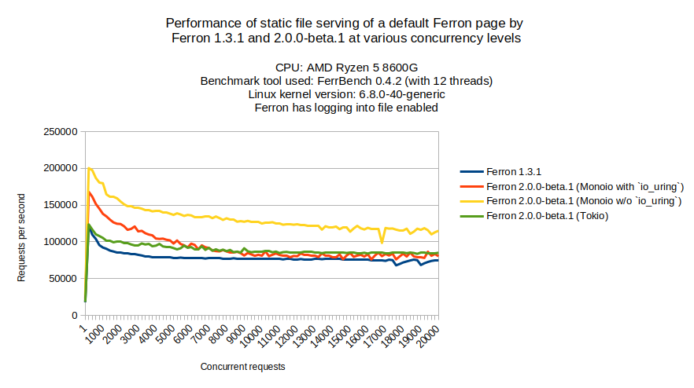

We are very excited to announce Ferron 2.0.0-beta.1, the first beta version of what it would be Ferron 2.0.0. We have rewritten the web server to be faster, and easier to configure. Also, the new web server will support zero-setup automatic TLS enabled by default.

## What's new?

### Speed thanks to a new asynchronous Rust runtime

Ferron 2.0.0-beta.1 got faster, thanks to [Monoio](https://github.com/bytedance/monoio) - an asynchronous runtime for Rust that utilizes `io_uring` (a API for asynchronous I/O present on Linux). Also, there is an option to use Tokio as a main asynchronous runtime at the compile time, in case Monoio won't work.

The pre-built executables will use Tokio for Windows, and Monoio for other operating systems.

### Ease of configuration

Ferron 2.0.0-beta.1 now supports [KDL](https://kdl.dev) configuration, which some people might view it as similar to Caddyfiles, present in a popular Caddy web server. We have seen some people complaining about YAML configuration format, so we have switched to KDL. YAML configurations will still work with Ferron 2.0.0 - you can also translate them to KDL using the `ferron-yaml2kdl` command.

### Zero-setup automatic TLS enabled by default

Ferron 2.0.0-beta.1 will enable automatic TLS by default for hosts without ports specified, similarly to what Caddy web server does ([the person who created Caddy even posted about this on X/Twitter](https://x.com/mholt6/status/1925404123530502759)). Also, if the home directory of Ferron user is configured correctly, the automatic TLS cache is stored in a subdirectory of the home directory, making automatic TLS configuration zero-setup.

## Installation

Right now, the installer for Ferron 2.x isn't available yet, nor are the Ferron 1.x to 2.x updater, nor Docker images, so stay tuned!

You can however [install Ferron manually](https://develop-v2.ferronweb.org/docs/installation/manual/) for now.

## Notice about Docker images

If you would like to still use Ferron 1.x or its YAML configurations, it's recommended to use `ferronserver/ferron:1` or `ferronserver/ferron:1-alpine` as a base instead of `ferronserver/ferron:latest` or `ferronserver/ferron:alpine` respectively.

## Thank you!

We appreciate all the feedback and contributions from our community. Your support helps us improve Ferron with each release. Thank you for being a part of this journey!

_The Ferron Team_
