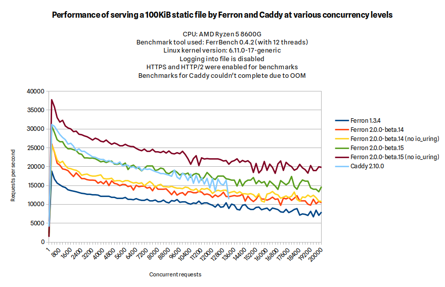

We are excited to introduce Ferron 2.0.0-beta.15, with many new features, improvements and fixes.

## Key improvements and fixes

### ACME EAB (External Account Binding) support

Added support for ACME EAB (External Account Binding) to allow creating ACME accounts linked to external accounts. This can be useful when configuring Ferron to obtain certificates from Google Trust Services.

### CIDR ranges in `block` and `allow` directives

Added support for CIDR ranges in `block` and `allow` directives, allowing greater flexibility in controlling access to your site.

### Conditional configurations

Ferron now supports conditional configurations via `condition`, `if` and `if_not` blocks. These blocks allow you to conditionally include or exclude configuration settings based on certain conditions.

This is an example configuration that has conditional configurations:

```kdl
www.example.com {
    condition "IS_MOBILE" {
        // Check if the browser is mobile based on the user agent
        is_regex "{header:User-Agent}" "(Mobile|Android|iPhone|iPad)" case_insensitive=#true
    }

    if "IS_MOBILE" {
        // Serve mobile content
        root "/var/www/mobile"
    }

    if_not "IS_MOBILE" {
        // Serve desktop content
        root "/var/www/desktop"
    }
}
```

### External modules and DNS providers

Ferron now supports external modules and DNS providers. This allows you to extend Ferron's functionality with custom modules and integrate with various DNS providers, without modifying the core codebase.

Ferron can be compiled with additional modules and DNS providers by copying the `ferron-build.yaml` file to `ferron-build-override.yaml` and modifying it as needed.

The modules and DNS providers are essentially Rust crates that can be added to the Ferron build process. You can read the [module and DNS provider development notes](https://github.com/ferronweb/ferron/blob/2.x/MODULES.md) , and [compilation notes](https://github.com/ferronweb/ferron/blob/2.x/COMPILATION.md).

### Load balancer connection retries

Added support for load balancer connection retries to other backend servers in case of TCP connection or TLS handshake errors. This ensures that Ferron can continue serving requests even if a backend server is temporarily unavailable.

### Reusable snippets in KDL configuration

Added support for reusable snippets in KDL configuration. This allows you to define reusable blocks of configuration that can be included in multiple places in your configuration file.

This is an example configuration that has reusable snippets:

```kdl
snippet "HEADERS" {
    // Security headers
    header "Content-Security-Policy" "default-src 'self'; img-src 'self' data:; font-src 'self'"
    header "X-Frame-Options" "SAMEORIGIN"
    header "X-Content-Type-Options" "nosniff"
}

www.example.com {
    // Use security headers
    use "HEADERS"

    // Serve example site
    root "/var/www/example"
}

blog.example.com {
    // Use security headers
    use "HEADERS"

    // Serve blog site
    root "/var/www/blog"
}
```

### `status` directives without `url` nor `regex` props

Added support for `status` directives without `url` nor `regex` props. This allows you to define status codes that should be returned for specific paths or patterns without having to specify a URL or a regular expression.

### New styles for default error pages and directory listings

Updated the styles for default error pages and directory listings to use more modern and responsive design.

### ASGI graceful shutdown fix

Fixed an issue where the ASGI server would be stuck while gracefully shutting down.

### HTTP to HTTPS redirect fixes

Fixed several erroneous HTTP to HTTPS redirects, allowing for more accurate and secure redirections.

### Overall performance improvements

Ferron 2.0.0-beta.15 brought overall performance improvements. Below are the performance benchmark results comparing between various versions of Ferron and the latest version of Caddy:



As you will see, Ferron 2.0.0-beta.15 had higher throughput at static file serving (with and without `io_uring` enabled) than the previous version - Ferron 2.0.0-beta.14. Also, Ferron 2.0.0-beta.15 with `io_uring` enabled had static file serving performance comparable to Caddy (at least until there were OOM issues when benchmarking Caddy), and without `io_uring` enabled, it had even higher throughput.

### Automatic host configuration order

The server now determines the host configuration order automatically based on the hostname specificity. The server no longer requires explicit ordering of host configurations.

### Automatic location configuration order

The server now determines the location configuration order automatically based on the path specificity and conditionals' depth. The server no longer requires explicit ordering of location configurations.

### No automatic TLS for "localhost"

The server will not automatically configure TLS for "localhost" domains. Automatic TLS via ACME with many certificate authorities would not work for "localhost" domains. If you need to use TLS for "localhost", you can configure it manually using the `tls` directive.

### YAML to KDL header value inheritance

The YAML to KDL configuration translator now inherits header values from higher configuration levels in YAML configuration to the KDL configuration. This allows for more accurate translation and ensures that header values are correctly propagated throughout the configuration.

## Thank you!

We appreciate all the feedback and contributions from our community. Your support helps us improve Ferron with each release. Thank you for being a part of this journey!

_The Ferron Team_
