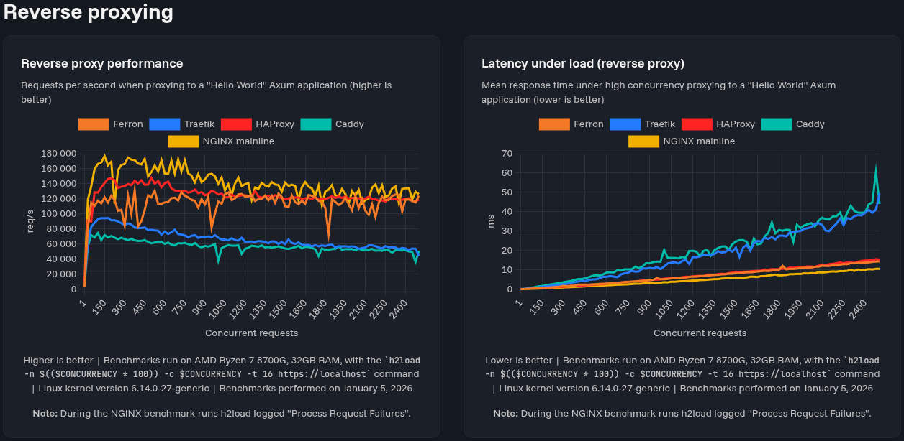
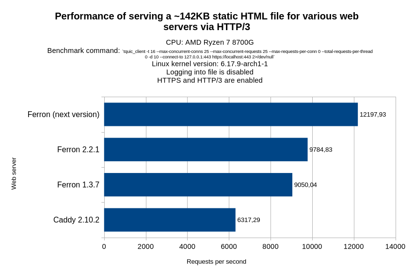
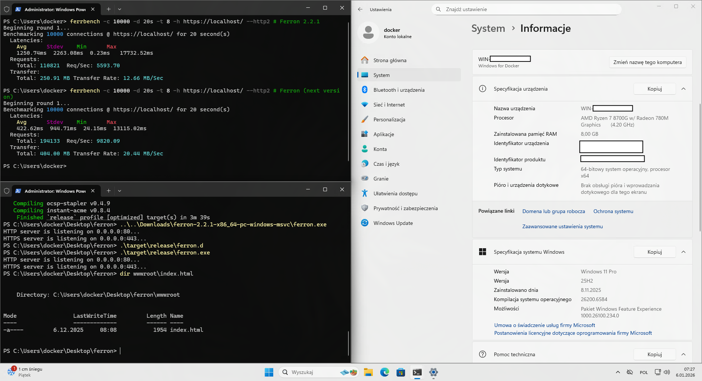

We are excited to introduce Ferron 2.3.0, which brings many new features, improvements and fixes. This release removes artificial reverse-proxy bottlenecks, improves HTTP/2 and HTTP/3 scalability, hardens TLS and ACME behavior, and significantly reduces operational failure modes.

## Key improvements and fixes

### Reverse proxy performance optimizations

We have been very focused on optimizing the reverse proxy performance in Ferron. This is because in our tests, when load-testing the previous version of Ferron with HTTP/3 requests, and after that, sending a regular request, the regular request was "stuck".

We have done various architectural changes to optimize the reverse proxy performance, most importantly: using an unlimited idle kept-alive connection pool instead of a limited pool. The pool also has a limit of concurrent connections enabled by default, to prevent TCP port exhaustion.

Also, on the reverse proxy internals, the reverse proxy also no longer waits for non-ready connections to be ready (it now just pulls another connection from the pool). This reduces head-of-line blocking (which occurs when a packet queue is held up by the first packet).

We have also [updated the performance benchmarks](/benchmarks)! (spoiler alert: from this post, it's possible to conclude that Ferron's reverse proxy performance can match that of HAProxy).



And because of these architectural changes, we removed a configuration directive that would no longer apply to the new architecture - `proxy_keepalive_idle_conns`. It's now ignored by the reverse proxy and logged in the error log as unused.

### HTTP/3 and QUIC performance optimizations

Yes, we have also optimized HTTP/3 and QUIC performance (even though HTTP/3 support in Ferron is considered experimental).

We have performed benchmarks on various versions of Ferron, and got this:



### No more support for very early 64-bit x86 CPUs

Unfortunately, when we optimized our web server, we ended up dropping support for very early 64-bit x86 CPUs in pre-built binaries.

This is because we have switched the memory allocator (from mimalloc v2 to mimalloc v3), except on 32-bit x86 CPUs. The new memory allocator would require POPCNT instruction on 64-bit x86, so unfortunately no more support for some very early 64-bit x86 CPUs (such as AMD K8, which includes early Athlon 64 and very early Opteron CPUs).

It's also possible to compile a version of Ferron from the source (with a patch that would replace the memory allocator), which would work on those 64-bit x86 CPUs.

### Various correctness improvements

We have also done some improvements to correctness of the web server.

For example, the server now removes some response headers that are invalid in HTTP/3, if the client is connected to the server via HTTP/3.

Also, we have fixed a CGI, SCGI and FastCGI interoperability issue caused by the wrong value of the "HTTPS" variable. This was after we saw [a bug report for Ferron](https://github.com/ferronweb/ferron/issues/371) saying that there was redirect loop when trying to use Matomo with Ferron. And we found the issue to be caused by a wrong value of the "HTTPS" variable. Strangely, the value was "ON", not "on", and Matomo didn't recognize that.

### Improvements on Windows

Yes, we have also improved Ferron on Windows, even though we have optimized it more for Linux.

First, we have made it faster, thanks to usage of Monoio (or rather [a fork of it](https://github.com/DorianNiemiecSVRJS/monoio)) instead of only using Tokio. The reason why we didn't use Monoio earlier, is because of performance degradation when using it on Windows. Though we have found that cause of it - it was a handle leak...



Next, we have figured out the platform-specific difference present on Windows (from one of the [Microsoft's documentation pages](https://learn.microsoft.com/en-us/windows/win32/winsock/dual-stack-sockets)):

> By default, an IPv6 socket created on Windows Vista and later only operates over the IPv6 protocol. In order to make an IPv6 socket into a dual-stack socket, the [**setsockopt**](https://learn.microsoft.com/en-us/windows/desktop/api/winsock/nf-winsock-setsockopt) function must be called with the **IPV6_V6ONLY** socket option to set this value to zero before the socket is bound to an IP address. When the **IPV6_V6ONLY** socket option is set to zero, a socket created for the **AF_INET6** address family can be used to send and receive packets to and from an IPv6 address or an IPv4 mapped address.

This caused Ferron to work with IPv6 only by default on Windows. Ferron now should also work with IPv4, when IPv6 is enabled.

### Automatic TLS robustness improvements

We have also improved the robustness of automatic TLS certificate management functionality.

First, the server now no longer fails automatic TLS certificate management tasks, when the ACME cache is inaccessible or corrupted. We did this after our website had TLS-related problems, and we ended up clearing the ACME cache and switching the certificate authorities (because we have hit Let's Encrypt rate limits).

Also, we have fixed errors related to invalid configurations when using URL-safe Base64-encoded ACME EAB key HMACs with "=" at the end (in the `auto_tls_eab` directive).

### URL sanitizer opt-out

Yes, we have added an option to disable the URL sanitizer, but because there were some web applications that require specific path URL encoding, but didn't work with Ferron's reverse proxy functionality, because the URL sanitizer was rewriting the URL. There is [a relevant issue on GitHub](https://github.com/ferronweb/ferron/issues/139).

Let's quote the Ferron documentation:

> Ferron by default rewrites the request URL before sending the request to the backend server, to protect against path traversal attacks.
>
> However, there are web applications that may not work with this default configuration. This can result in 404 Not Found errors, and other issues.
>
> In such cases, you can disable the URL sanitizer (although Ferron won't protect the backend server from path traversal attacks, the backend server must protect itself against such attacks):
>
> ```kdl
> // Example configuration with reverse proxy and intact request URL. Replace "example.com" with your domain name.
> example.com {
>     proxy "http://localhost:3000/" // Replace "http://localhost:3000" with the backend server URL
>     disable_url_sanitizer
> }
> ```

### Other changes

Because there were lots of changes since the last release, we're just going to list the rest of them:

- Added a metric for reverse proxy connections (grouped by whether the connection is reused)
- Added support for canonicalized IP address placeholders.
- Added support for global and local reverse proxy TCP connection concurrency limits.
- Added support for timeouts for idle kept-alive connections in a reverse proxy.
- Fixed an XSS bug through server administrator's email address specified in the server configuration.
- Fixed explicit TLS version configuration being incorrectly applied.
- Improved error reporting for invalid URLs for SCGI and FastCGI.
- Optimized the performance of overall network I/O.
- Slightly optimized ETag generation for static file serving.
- The H3_NO_ERROR errors are no longer logged into the error log.

## Thank you!

We appreciate all the feedback and contributions from our community. Your support helps us improve Ferron with each release. Thank you for being a part of this journey!

_The Ferron Team_
