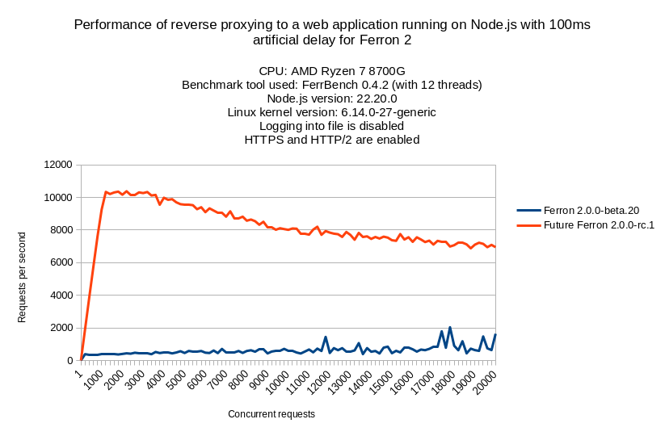

We're so excited to announce the first release candidate for Ferron 2 - Ferron 2.0.0-rc.1, bringing many new features and improvements.

This release also marks what it would be the next step towards the final launch of Ferron 2. We have been working on rewriting Ferron to be even faster, easier to configure, and more powerful.

## Key improvements and fixes

### `ferron-precompress` utility

Added an utility to precompress static files (`ferron-precompress`) before Ferron serves them. Precompressing static files can reduce the overhead of compressing static files on-the-fly, improving the performance of your website.

The usage for `ferron-precompress` utility can be found in the [documentation](/docs/commands).

### Rego-based subconditions

Added support for Rego-based subconditions, allowing you to define more complex subconditions using the Rego policy language.

Below is an example of a Ferron configuration that defines a Rego-based subcondition that denies requests from the `curl` user agent:

```kdl
// Replace "example.com" with your domain name.
example.com {
  condition "DENY_CURL" {
    is_rego """
      package ferron

      default pass := false

      pass := true if {
        input.headers["user-agent"][0] == "curl"
      }

      pass := true if {
        startswith(input.headers["user-agent"][0], "curl/")
      }
      """
  }

  if "DENY_CURL" {
    status 403
  }

  // Serve static files
  root "/var/www/html"
}
```

### Maximum idle connections to backend servers specification

Added support for specifying maximum idle connections to backend servers to keep alive. This allows greater configuration flexibility, which can help optimize performance and reduce resource usage.

Excerpt from the Ferron documentation:

> - `proxy_keepalive_idle_conns <proxy_keepalive_idle_conns: integer>` (_rproxy_ module; Ferron 2.0.0-rc.1 or newer)
>   - This directive specifies the maximum number of idle connections to backend servers to keep alive. Default: `proxy_keepalive_idle_conns 48`

### Various load balancing algorithms

Added support for the following load balancing algorithms (alongside random selection):

- round-robin
- power of two random choices
- least connection

The round-robin algorithm ensures that the requests are distributed evenly, while the power of two random choices and least connection algorithms ensure that the requests are distributed based on the backend servers' load.

Excerpt from the Ferron documentation:

> - `lb_algorithm <lb_algorithm: string>` (_rproxy_ module; Ferron 2.0.0-rc.1 or newer)
>   - This directive specifies the load balancing algorithm to be used. The supported algorithms are `random` (random selection), `round-robin` (round-robin), `least_conn` (least connections, "connections" would mean concurrent requests here), and `two_random` (power of two random choices; after two random choices, the backend server with the least concurrent requests is chosen). Default: `lb_algorithm "two_random"`

### New default load balancing algorithm

We have changed the default load balancing algorithm from random selection to power of two random choices, ensuring that the requests are distributed based on the backend servers' load by default.

### Subcondition error handling improvements

Improved subcondition error handling by logging specific subcondition errors. This makes it easier to troubleshoot issues related to conditional configuration.

### Keep-alive behavior optimization

Optimized the keep-alive behavior in reverse proxying and load balancing, improving the performance for these use cases.



As you will see from the benchmark results above, Ferron 2.0.0-rc.1 outperforms the previous beta version significantly, when it comes to reverse proxying to a web application running on Node.js with a 100ms artificial delay.

Below is the used Ferron web server configuration:

```kdl
localhost {
    tls "tls/server.crt" "tls/server.key" // Replace the paths with your own certificate and key files

    proxy "http://localhost:3000"
    proxy "http://localhost:3001"
    proxy "http://localhost:3002"
    proxy "http://localhost:3003"
    proxy "http://localhost:3004"
    proxy "http://localhost:3005"
    proxy "http://localhost:3006"
    proxy "http://localhost:3007"
    proxy "http://localhost:3008"
    proxy "http://localhost:3009"
    proxy "http://localhost:3010"
    proxy "http://localhost:3011"
    proxy "http://localhost:3012"
    proxy "http://localhost:3013"
    proxy "http://localhost:3014"
}
```

Also, below is the code for the web application running on Node.js:

```javascript
const http = require("http");

const numBackends = 15;
let backendRequestsHit = [];

function printBackends() {
  console.clear();
  console.log("Backend Requests Hit:");
  for (let i = 0; i < numBackends; i++) {
    console.log(`  Backend #${i + 1}: ${backendRequestsHit[i]}`);
  }
}

for (let i = 0; i < numBackends; i++) {
  const backendId = i;
  backendRequestsHit.push(0);
  http
    .createServer((req, res) => {
      backendRequestsHit[backendId]++;
      printBackends();
      setTimeout(() => {
        res.end(`Hello from backend #${backendId + 1}!`);
      }, 100);
    })
    .listen(3000 + i);
}

printBackends();
```

### Health check window configuration no longer global-only

The `lb_health_check_window` directive (used to configure the health check window for load balancing) is no longer global-only. This allows greater flexibility in configuring health checks for different backend servers.

### Non-existent ACME account cache removal

The web server now removes ACME accounts from the ACME cache, if they don't exist in an ACME server. This improves the reliability of automatic certificate management functionality.

## Thank you!

We appreciate all the feedback and contributions from our community. Your support helps us improve Ferron with each release. Thank you for being a part of this journey!

_The Ferron Team_
