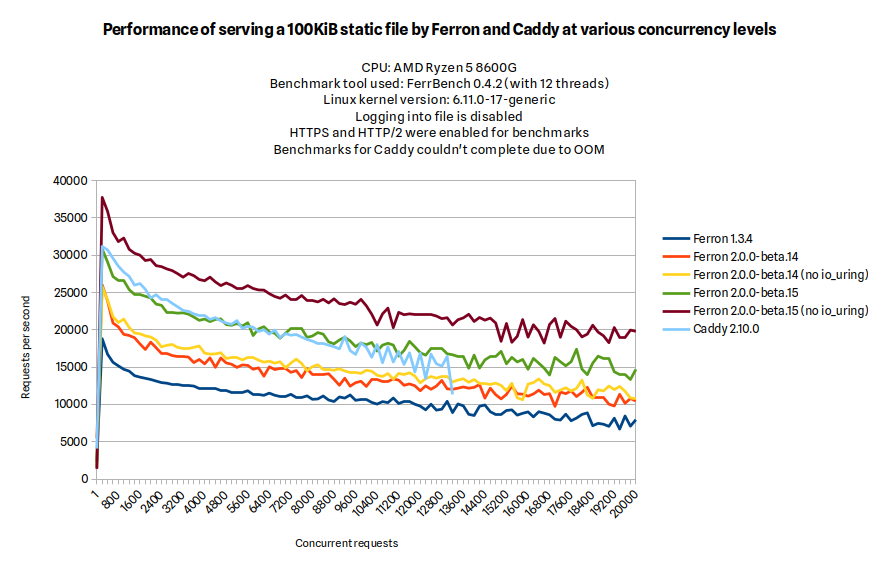

We are so excited to announce Ferron 2 - a fast, modern, and easily configurable web server with automatic TLS.

## Why Ferron 2?

After we got suggestions from the community, we have decided to rewrite the Ferron web server to apply the suggestions. We have ended up with a faster, easier to use, and more powerful web server.

### Ease of use

Ferron 2 now supports [KDL](https://kdl.dev) configuration format as an easier-to-configure format compared to Ferron 1.x YAML configuration.

Below is an example Ferron 2 KDL configuration:

```kdl
example.com {
  proxy "http://localhost:3000"
}
```

Below is an equivalent Ferron 1.x YAML configuration:

```yaml
global:
  secure: true
  enableAutomaticTLS: true
  automaticTLSContactCacheDirectory: "/var/cache/ferron-acme" # Replace "/var/cache/ferron-acme" with actual cache directory. Optional property, but recommended
  loadModules:
    - "rproxy"

hosts:
  - domain: "example.com" # Replace "example.com" with your website's domain name
    proxyTo: "http://localhost:3000"
```

As you have seen above, Ferron 2 KDL configuration is less verbose than Ferron 1.x YAML configuration for a single reverse proxy host with automatic TLS enabled.

If you would like to translate Ferron 1.x YAML configuration to Ferron 2 KDL configuration, you can do so with `ferron-yaml2kdl` command that comes with Ferron:

```bash
ferron-yaml2kdl ferron.yaml ferron.kdl
```

### Automatic TLS improvements

Ferron 2 will enable automatic TLS by default for hosts without ports specified.

The person who created Caddy web server even [posted about this on X/Twitter, even when we were just getting started on the rewrite](https://x.com/mholt6/status/1925404123530502759).

Below is an example Ferron 2 KDL configuration for a host with automatic TLS enabled:

```kdl
example.com {
  root "/var/www/example.com"
}
```

### Optimized performance

Ferron 2 also brings more optimized performance compared to Ferron 1.x. Below are performance benchmark results comparing Ferron 1.x, two Ferron 2 beta versions, and Caddy.



As you have seen above, Ferron 2.0.0-beta.15 (a beta version of Ferron 2) had higher throughput at static file serving than Ferron 1.3.4, and comparable throughput as Caddy (when `io_uring` was disabled, the throughput was even higher).

As these results are for beta versions of Ferron 2, they may not be representative of the final release. However, they do provide a good indication of the performance improvements that Ferron 2 offers over Ferron 1.x.

## How can I install Ferron 2?

There are multiple official ways to install Ferron 2:

- [Installer (GNU/Linux)](/docs/installation/installer-linux)
- [Installer (Windows Server)](/docs/installation/installer-windows)
- [Debian/Ubuntu](/docs/installation/debian)
- [RHEL/Fedora](/docs/installation/rpm)
- [Docker](/docs/installation/docker)

## How can I upgrade from Ferron 1.x?

If you installed Ferron 1.x using the official installer for GNU/Linux, you can upgrade to Ferron 2.x by running the following command:

```bash
sudo bash -c "$(curl -fsSL https://get.ferron.sh/v1-to-v2)"
```

## How can I configure Ferron 2?

You can configure Ferron 2 by editing the `ferron.kdl` file in a location dependent on how you installed it. You can also read the [configuration reference](/docs/configuration-kdl) to learn more about the available configuration directives.

## Thank you!

We appreciate all the feedback and contributions from our community. Your support helps us improve Ferron with each release. Thank you for being a part of this journey!

_The Ferron Team_
