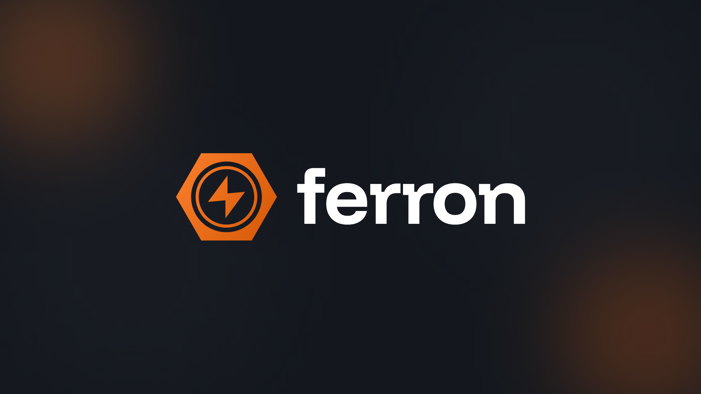
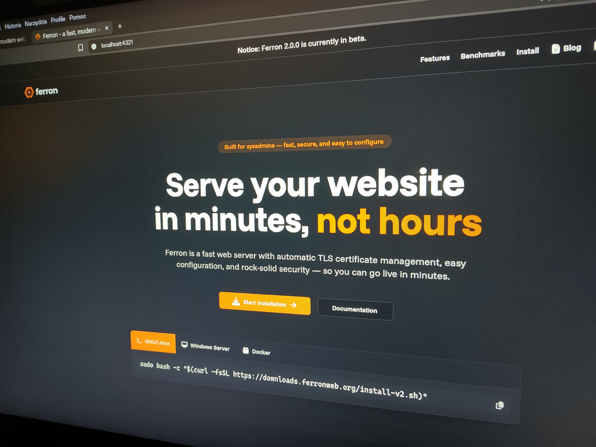
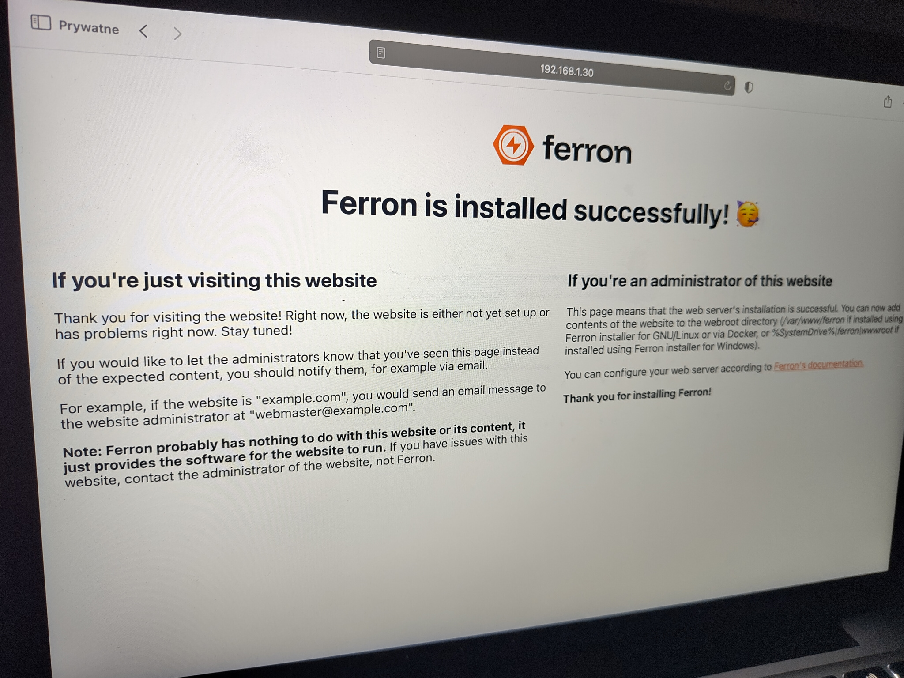
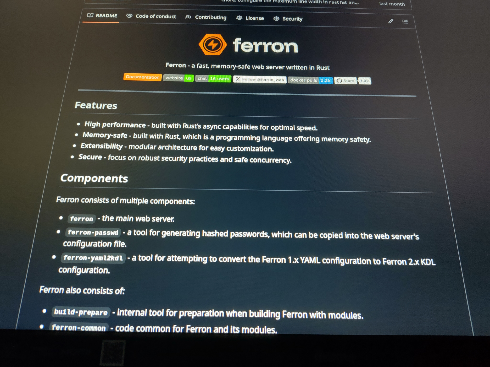

As we're rewriting Ferron to be even faster and easier to use (the rewrite - Ferron 2 - is now available as beta releases), we're also updating the branding to reflect the new version. This includes updating the logo, color scheme, and overall design to better represent the new Ferron.

We're gradually rebranding Ferron after starting the rewrite - we have got our website redesigned for the Ferron 2, and now we're changing the logo.

## The new logo

We have got our logo redesigned to appear more modern and professional.

The icon has a metallic nut (which suggests robustness and refers to the "Ferron" name), and inside of it, a lightning bolt (which can suggest both the high performance for an easy-to-use web server, and the speed of setting up a new website). The icon is in a soft, orange gradient that is smooth, and more modern.

The font is a modern sans-serif typeface, giving it a modern feel. The squares in the letters give it a "tech" feel; the logo itself expresses a more casual style.

## Brand materials

If you would like to use some elements of the Ferron brand, you can download [the logos](https://downloads.ferronweb.org/brand/logos.zip), and [the brand style guidelines document](https://downloads.ferronweb.org/brand/brand-style-guidelines.pdf).

## The recap

Now that we have changed the logo, we're continuing to develop what it would be Ferron 2, which will be faster, easier to use, and more powerful. Stay tuned!
